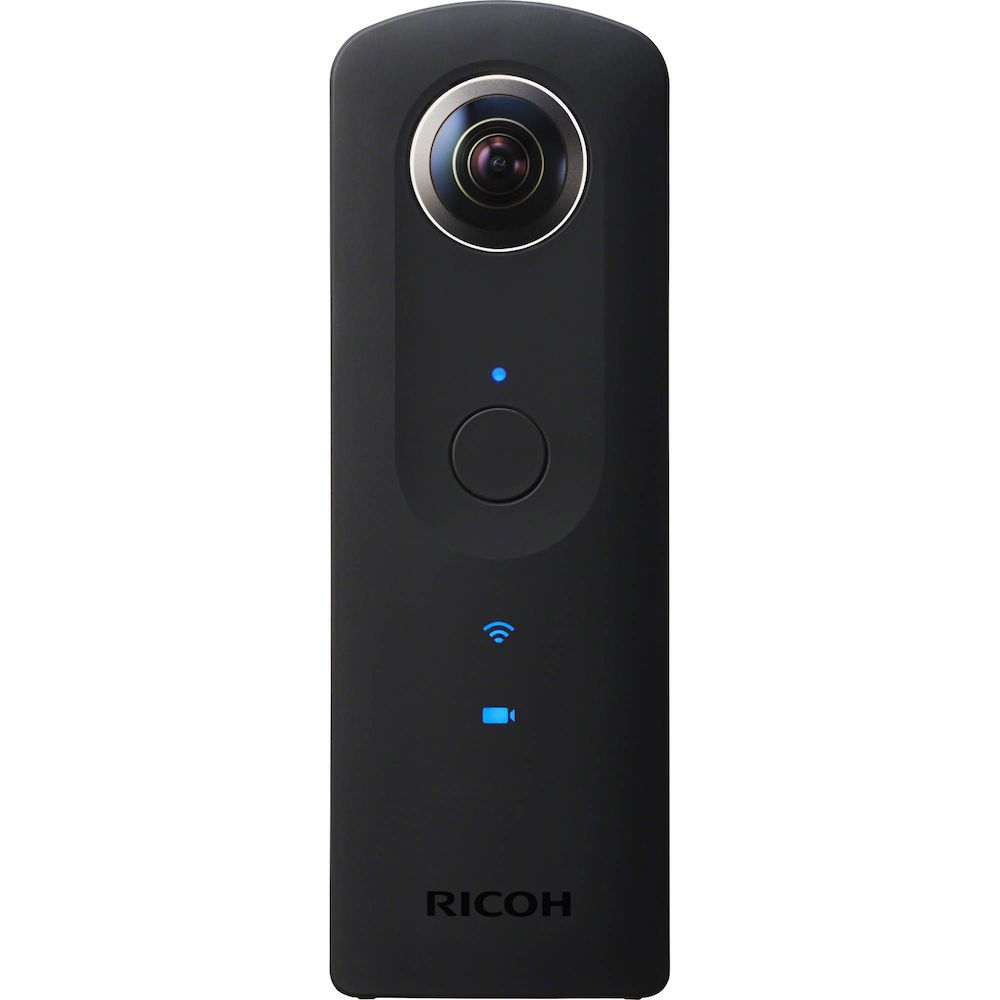

# Welcome To OA's Theta S!
搭配 Ricoh Theta S 記錄環景、全景、360度、小星球(Stereographics Projection) 的一個 OA's 個人全景相簿！

---
 
## 範例
Demo: [http://comdan66.github.io/ThetaS/index.html](http://comdan66.github.io/ThetaS/index.html)

 
## 聲明
本作品授權採用 姓名標示-非商業性 2.0 台灣 (CC BY-NC 2.0 TW) 授權，詳見 [http://creativecommons.org/licenses/by-nc/2.0/tw/](http://creativecommons.org/licenses/by-nc/2.0/tw/)

 
## 簡介
* 純粹因為買了一台 Ricoh Theta S，就想說來寫一個 360度 全視角的相簿！
* 搭配 Ricoh Theta S 記錄環景、全景、360度、小星球(Stereographics Projection) 的個人全景相簿！

 
## RICOH THETA S
* ㄜ.. 他就是 [RICOH THETA S](https://theta360.com/ct/)  
￬ ￬ ￬ ￬ ￬ ￬ ￬ ￬ ￬ ￬ ￬ ￬ ￬ ￬ ￬ ￬ ￬ ￬   

 
## 關於
* 作者名稱 - [OA Wu](http://www.ioa.tw/)

* E-mail - <comdan66@gmail.com>

* 作品名稱 - OA's Theta S

* 最新版本 - 1.1

* GitHub - [OA's Theta S](https://github.com/comdan66/ThetaS)

* theta-viewer.js - [theta-viewer.js](https://github.com/shokai/theta-viewer.js)

* 更新日期 - 2015/12/18